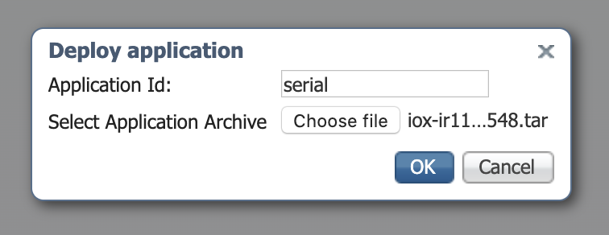

# iox-ir1101-serial-port
Sample code to use serial port (async0) in IOx from Cisco IR1101

Cisco Industrial Router 1101 (IR1101) is equiped with a serial port that is of Data Terminal Equipment (DTE) type and only supports serial protocol RS232.

## Introduction

In this project we will connect a router Cisco IR1101 asynchronous serial port (async0) to a computer using a serial connection - note that this is different than accessing the router console using a serial port. In this case we will use a Cisco IOx container application to use an RS232 / RJ45 port on the IR1101. This is independant of the console port and not for configuring the platform.

For convenience we will be using USB-to-serial converter, the same one we use for console, because that is something most people have. The the Cisco serial-console is not a "standard" serial pinout and is not compatible with RJ45 serial cables, therefore we will build a small adapter that allows to use the Serial console cable as a normal serial cable for this project. This is an optional step for education purpose only.

Lastly an IOx application will be build using Docker, Python and pySerial to communicate with that serial port. In practice you may use this configuration to talk to any serial device, be it a Modbus device, a virtual RTU, a sensor.

## Hardware

Cisco IR1101 RS232 port is following EIA/TIA-561 RS232 specifications and must be connected appropriately. For the serial RJ45 connector on this platform those three wires must be connected appropriately to the remote serial device [as explained in the IR1101 documentation](https://www.cisco.com/c/en/us/td/docs/routers/access/1101/b_IR1101HIG/b_IR1101HIG_chapter_01.html#con_1201913):

| PIN# | Function      |
|------|---------------|
| 5    | RS232 Rx (receive)  |
| 6    | RS232 Tx (Transmit) |
| 4    | GND (Ground)        |

Tx on one side must connect to Rx on the other side, and conversely. You cannot directly use a Cisco USB 'baby blue' console cable as the pinout is different.


However you can build an intermediate device that will map the IR1101 serial port to Cisco Console serial port mapping. This will work only with the Cisco compatible console cable and with nothing else.

The following cable RJ45 male goes in IR1101, and the female if to receive your Cisco USB console. The pinout is:

| RJ45 IR1101 cable side (male)    | RJ45 Console cable side (female)   |
|------|---------------|
| 5 - RXD | RXD - 3  |
| 6 - TXD | TXD - 6  |
| 4 - GND | GND - 4  |

Here is an example of such an adapter build using very handy screw-on RJ45 adapters:


From now one we assume that the serial device is physically connected to the IR1101.

## IOS-XE Configuration

Cisco IOS-XE can use the serial port for other purposes than IOx, therefore for the serial port to be available to IOx application it needs to be configured to use the [Serial Relay Service (configuration guide)](https://www.cisco.com/c/en/us/td/docs/routers/access/1101/software/configuration/guide/b_IR1101config/b_IR1101config_chapter_010100.html) which will relay serial packets over to IOx's virtual serial port. In essence on the router console configure:

```
interface Async0/2/0
 encapsulation relay-line
relay line 0/2/0 0/0/0
```

## Building the Python application

Now we are all set with the prerequitites, we can take the IOx application itself. Python will be used to open a serial port, read data, and echo the data back. We will read in chunk every few seconds, and reply back with that chunk of data between brackets.

You can clone the entiere repository on your computer with:

    git clone https://github.com/etychon/iox-ir1101-serial-port.git

In the iox-ir1101-serial-port you will find a Python script called `startup.py`. We will be using the serial module (from pySerial) and here is some of the code:

```
# use the pySerial module
import serial
# Get serial device name
serial_device = os.getenv("IR_SERIAL", "/dev/ttySerial")
# Open serial port
ser = serial.Serial(serial_device)
# Read
s = ser.read(ser.inWaiting())
# and Write
ser.write(str("["+ str(s)+"]").encode())
```

All this is pretty straightforward however I'd like to explain in more detail the purpose of:

    serial_device = os.getenv("IR_SERIAL", "/dev/ttySerial")

Because IOx application can run of different platforms, with different hardware configuration, it is not advised to hardcode the serial device, but instead to use an environment variable. In this case we have used `IR_SERIAL` and it also needs to be matched with the package.yaml that will be created later.

On some platforms the device might be `/dev/ttyS0`, `/dev/ttyUSB0` or `/dev/ttySerial`. Using an environment variable is the only way to make it clean and portable.

In the absence of such variable, in the example above, `/dev/ttySerial` will be used. If we want to be safe, in such a case where the information is missing, the container must exit instead of assuming a serial port. But this playground, so let's play.

## Dockerfile

The Dockerfile is used to build the Docker image and does the following:

1. Uses the base Alpine Linux rootfs,
1. Copies the qemu binaries to execute ARM commands on x86,
1. Installs Python 3 and pip3,
1. Installs the python requirements from requirements.txt,
1. and copies our python program.

Here is the Dockerfile (always check the actual repository for the latest version):

```
FROM multiarch/qemu-user-static:x86_64-aarch64 as qemu
FROM arm64v8/alpine
COPY --from=qemu /usr/bin/qemu-aarch64-static /usr/bin
COPY requirements.txt /
RUN apk add --no-cache python3 py3-pip
RUN pip3 install -r requirements.txt
COPY startup.py /
ENTRYPOINT python3 startup.py
```

Now that we have everything in place the image can be built using:

    docker build -t iox-ir1101-serial-port .

## Package Descriptor

In IOx the [Package Descriptor](https://developer.cisco.com/docs/iox/#!package-descriptor) is a file that describes what the application needs to run. Refer to the actual documentation for the full syntax but the interesting portion here is the serial port requirement:

```
app:
  cpuarch: "aarch64"
  type: docker
  resources:
    profile: c1.tiny
    devices:
      -
        label: IR_SERIAL
        type: serial
        usage: "Serial async0"
    network:
      -
        interface-name: "eth0"
  startup:
    rootfs: rootfs.tar
    target: ["python3","/startup.py"]
```

Note how the label matches the environment variable in the `startup.py` program. If you do specify a serial port in package.yaml, having it assigned to the application is becoming a mandatory requirement to activate the application. You can always add a serial port to an application that did not required explicitly a serial port.

Also note the `target` which is what will be executed when our image runs and becomes a container. Always remember that the container stops when the target stops, so ideally your program should never exit unless there is an unrecoverable error.

## Building the IOx application

Now that we have built our docker image, and we have created a `package.yaml` file we can go on and build the IOx application with `ioxclient`:

    ioxclient docker package iox-ir1101-serial-port . -n iox-ir1101-serial-port

Alternatively you can also simply run the `build.sh` script in the repository:

    sh ./build.sh

The output is a file called `iox-ir1101-serial-port.tar`. This is your IOx application and it can be used for deployment using either:

* ioxclient (CLI)
* Cisco IOS-XE App Hosting CLI
* Cisco IOx Local Manager (WebUI)
* Cisco Gateway Management Module (GMM) - Cloud service
* Cisco Field Network Director (FND) - On prem
* Cisco Fog Director (not available as a standalone product anymore)

Below we will deploy the application using Cisco IOx Local Manager.

## IOx Local Manager

### Connection

IOx Local Manager is available using HTTPS on IR1101 on the gateway primary IP address, for instance `https://192.168.2.101/iox/login`. This will take you to Local Manager login page where you need to enter a valid username and password (same user and password as in IOS-XE):


### Deploy IOx application

Once logged in you are greeted with the IOx Local Manager main page.


Click on `Add New` and select the file `iox-ir1101-serial-port.tar` that was made previously, and give is a name (ie: serial). This name must be in small letters and cannot contain minus sign:



The application should be fully deployed:


### Activation

Now select the application `Activate` button. This is where parameters such as CPU or memory allocations, interface type, IP address mapping can be changed.

For an IOx application to use this port, it needs to be assigned to the IOx application during the activation phase. To do this, in the bottom right `Peripheral Configuration` click `edit` and assign `async0` to this label `IR_SERIAL` and click `Ok`.


Do you remember this is the label we have used in `package.yaml` and `startup.py`. It will be passed as an environment variable `${IR_SERIAL}` to the IOx application? From inside the runnin container, environment variables can be directly accessed using any supported method such as:

```
# echo ${SERIAL}
/dev/ttySerial
```

Now click on `Activate App` and you should be done. The application is activated which means all the resources have been reserved but it is not yet running.

### Start the IOx application

Go to the `Applications` tab and select `Start` for your freshly activated application. After a dozen of seconds the status should turn to `Running`.

Select `Manage` and go to `Logs` where a log file `iox-serial-port.log` will be shown and contains the output of our program. Try to enter some data and it should echo it back every few seconds, like so:

    [hello][ wor][ld ho][w are y][ou doing?]
